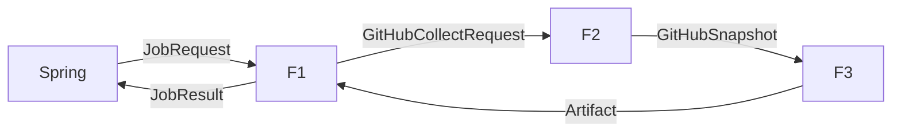

# Blocki-AI GitHub Agent DESIGN

- project: Blocki-AI (DevFlow / Portfolio Agent — FastAPI · LangGraph)
- version: 0.1
- one-liner: Spring이 넘긴 유저별 GitHub PAT로 remote GitHub MCP를 호출하고, 진행 메모·포트폴리오·README 개선 산출물을 돌려주는 무상태 에이전트 워커
- date: 2026-08-19
- module count: 3 features (F1–F3), C0 없음
- scale verdict: **Small** — 현재 코드 0파일. Feature 레벨만. C0 금지로 시작.

## TOC

1. Tech stack
2. Folder tree
3. Main pipeline
4. C0 modules
5. Extension points
6. Feature modules
7. Team contracts
8. Dependency table
9. Implementation checklist
10. Design Decision Log

---

## 1. Tech-stack table

명세와 담당 분담이 이미 잠겨 있어 이 표를 기본값으로 확정한다. (Phase 1 승인 게이트 — 이미 답한 항목은 재질문하지 않음)

| 영역 | 기술 | 이유 |
| --- | --- | --- |
| 에이전트 HTTP | FastAPI | 담당 스택. Spring이 부르는 내부 API만 둔다. |
| 워크플로 | LangGraph | 다단계 수집→요약→산출. 그래프별로 도구 집합을 다르게 준다. |
| GitHub 도구 | Remote GitHub MCP `https://api.githubcopilot.com/mcp/` | 사용자가 지정한 엔드포인트. PAT를 `Authorization: Bearer`로 넘기는 공식 경로. 로컬 Docker MCP는 쓰지 않는다. |
| MCP 클라이언트 | `langchain-mcp-adapters` `MultiServerMCPClient` | LangGraph 도구로 바로 붙는다. `transport: "http"`, job마다 headers를 새로 넣는다. |
| LLM | 환경변수로 모델만 교체 (OpenAI 호환 또는 팀 합의 모델) | 그래프와 분리. 키는 composition root에서만 읽는다. |
| 유저·토큰·스케줄 원본 | Spring Boot | FastAPI는 PAT를 저장하지 않는다. |
| Notion MCP | `https://mcp.notion.com/mcp` (팀원) | 이 레포는 Notion을 구현하지 않는다. F1이 draft를 넘기거나 훅만 연다. |
| 배포 | Docker on EC2 | 명세 비기능. FastAPI 단일 프로세스부터. |

선택하지 않은 것:

- FastAPI에 GitHub OAuth/토큰 DB를 두지 않음. 인증이 두 백엔드로 갈라진다.
- 로컬 `ghcr.io/github/github-mcp-server` 를 기본으로 두지 않음. remote가 막히면 그때만 fallback.
- 유저 JWT를 FastAPI가 직접 검증하는 구조를 기본으로 두지 않음. Spring→FastAPI는 내부 서비스 키.

---

## 2. Folder tree

```
Blocki-AI/
  DESIGN.md
  app/
    main.py                 # composition root — env, 라우터, 그래프 선택 맵
    api/
      jobs.py               # F1 public HTTP
    agents/
      github_collect.py     # F2
      artifacts/
        __init__.py         # ArtifactBuilder 타입 + 선택 맵이 쓰는 이름만 export
        progress.py         # F3-progress
        portfolio.py        # F3-portfolio
        readme.py           # F3-readme
    contracts.py            # JobRequest / JobResult / GitHubSnapshot 타입 (root가 import)
  tests/
    test_job_contract.py
    test_github_collect.py
    test_progress_artifact.py
```

`app/main.py` 가 유일한 composition root. 에이전트 모듈은 서로를 import하지 않는다.

---

## 3. Main pipeline



조건 분기는 F1 안에만 있다. 메인 라인은 항상 `F1 → F2 → F3 → F1`.

### OUT→IN chain

| 단계 | OUT | 다음 IN |
| --- | --- | --- |
| Spring | `JobRequest` | F1.main |
| F1 | `GitHubCollectRequest` | F2.main |
| F2 | `GitHubSnapshot` | F3.main |
| F3 | `Artifact` | F1 (pack) |
| F1 | `JobResult` | Spring |

파이프라인 기본 실패 정책: MCP 일시 오류는 `retry(2)`, PAT 없음/401은 `halt`, 활동 0건은 `skip-and-log` 후 빈 스냅샷으로 F3 진행.

---

## 4. C0 modules

none.

거부 기록:

- GitHub MCP 클라이언트 팩토리 — 사용 예정 지점이 F1 한 곳(루트가 F2에 tools를 넘김). rule of three 실패. F1 함수로 둔다.
- HTTP/JSON 파서, env 로더 — module floor 미달.
- Notion 클라이언트 — 이 레포 사용 지점 0. 팀원 영역.
- 공통 “AgentBase” / 레지스트리 프레임워크 — 구현체 3개가 아직 코드로 없다. Extension gate는 타입+선택 맵만 허용하고 프레임워크는 거부.

---

## 5. Extension points

계약: `build_artifact(snapshot: GitHubSnapshot, job: JobRequest) -> Artifact`

현재 variant (MVP 요구에 이미 3개):

| job_type | 모듈 | 도구 정책 |
| --- | --- | --- |
| `progress_memo` | `agents/artifacts/progress.py` | GitHub read-only |
| `portfolio_card` | `agents/artifacts/portfolio.py` | GitHub read-only |
| `readme_improve` | `agents/artifacts/readme.py` | repos 읽기 + PR 쓰기 (마지막에 연다) |

선택 맵 위치: `app/main.py` 의 `ARTIFACT_BUILDERS: dict[JobType, BuildFn]`.

variant 추가: `agents/artifacts/<name>.py` 하나 + `main.py` 맵에 한 줄.

---

## 6. Feature modules

### 공유 타입 (`contracts.py`)

루트와 피처가 같이 쓰는 타입만 둔다. 피처가 아니다.

```
JobType = "progress_memo" | "portfolio_card" | "readme_improve"

JobRequest
  job_id: str
  user_id: str
  job_type: JobType
  github_pat: str
  repos: list[RepoRef]          # 비면 F2가 유저 접근 가능 레포를 최대 N개
  since: datetime | null        # 기본: 24h
  notion: NotionHint | null     # opaque. 이 레포는 해석하지 않음
  extra: dict

RepoRef
  owner: str
  name: str

GitHubCollectRequest
  job_id: str
  github_pat: str
  repos: list[RepoRef]
  since: datetime
  toolsets: list[str]
  readonly: bool

GitHubSnapshot
  collected_at: datetime
  viewer_login: str | null
  repos: list[RepoActivity]
  warnings: list[str]

RepoActivity
  owner: str
  name: str
  default_branch: str | null
  commits: list[CommitSummary]   # sha, message, author, committed_at
  issues: list[IssueSummary]     # number, title, state, updated_at
  pull_requests: list[PrSummary] # number, title, state, updated_at
  readme: FileBlob | null        # path, content — readme job만 채움. 그 외 null

Artifact
  job_type: JobType
  title: str
  body_markdown: str
  structured: dict               # 포폴 카드 필드, PR 초안 등
  proposed_actions: list[Action] # 예: create_pr (실행 전 상태일 수 있음)

JobResult
  job_id: str
  ok: bool
  artifact: Artifact | null
  snapshot_summary: dict         # 커밋/이슈/PR 건수
  error: JobError | null
  notion_handoff: NotionHint | null

JobError
  code: "missing_pat" | "github_auth" | "github_rate_limit" | "mcp_unavailable" | "llm_failed" | "empty" | "internal"
  message: str
  retryable: bool
```

---

### F1 JobIngress

PUBLIC: `handle_job(req: JobRequest) -> JobResult`, `JobRequest`, `JobResult`

IN (main):

- `req: JobRequest` ← Spring HTTP body

IN (aux):

- `internal_key: str` ← `main.py` 가 env `INTERNAL_API_KEY` 를 읽어 헤더 검증에 사용
- `artifact_builders: dict[JobType, BuildFn]` ← `main.py` 선택 맵
- `collect_fn: CollectFn` ← F2 `collect_github`
- `llm` ← root가 구성한 모델 클라이언트 (F3에 전달)

OUT: `JobResult` (필드 위 공유 타입)

FAIL: `JobError`. 인증 헤더 실패는 HTTP 401이고 그래프에 들어가지 않음.

내부 로직:

1. `X-Internal-Key` 검증
2. `github_pat` 공백이면 `halt` / `missing_pat`
3. `GitHubCollectRequest` 구성. toolsets는 job_type으로 고정:
   - `progress_memo`, `portfolio_card`: `context,repos,issues,pull_requests` + `X-MCP-Readonly: true`
   - `readme_improve`: `context,repos,pull_requests` (쓰기 허용은 F3-readme가 PR을 낼 때만)
4. F2 호출 → F3 선택 맵 호출 → `JobResult` 포장
5. `req.notion` 이 있으면 `notion_handoff`에 그대로 실어 Spring/노션 파트에 넘긴다. Notion MCP 호출은 하지 않는다.

constraints:

- PAT를 로그/트레이스에 남기지 않는다.
- FastAPI는 유저 테이블을 갖지 않는다.
- 동기 HTTP 한 요청 = 한 잡. 타임아웃 기본 60s. 길면 Spring이 나중에 비동기 콜백을 붙인다 (지금은 없음).

parallel-safe: no (요청 단위 직렬. 워커 여러 개면 프로세스 여러 개)

REMOVE: `app/api/jobs.py` 삭제 + `main.py` 라우터 한 줄 제거. Spring 호출이 죽는다.

---

### F2 GitHubCollect

PUBLIC: `collect_github(req: GitHubCollectRequest) -> GitHubSnapshot`

IN (main):

- `req: GitHubCollectRequest` ← F1

IN (aux): 없음. PAT·URL은 req 안.

OUT: `GitHubSnapshot`

FAIL: `JobError(code=github_auth|github_rate_limit|mcp_unavailable)` — F1이 JobResult로 변환. 부분 실패(레포 1개 401)는 그 레포를 건너뛰고 `warnings`에 넣는다.

내부 로직:

1. job마다 `MultiServerMCPClient` 생성. 프로세스 전역 클라이언트를 유저 PAT로 재사용하지 않는다.

```python
client = MultiServerMCPClient({
    "github": {
        "transport": "http",
        "url": "https://api.githubcopilot.com/mcp/",
        "headers": {
            "Authorization": f"Bearer {req.github_pat}",
            "X-MCP-Toolsets": ",".join(req.toolsets),
            "X-MCP-Readonly": "true" if req.readonly else "false",
        },
    }
})
tools = await client.get_tools()
```

2. 고정 순서로만 도구를 부른다 (자유 루프 금지 — 해커톤에서 비용·폭주 방지):
   1. `get_me` → `viewer_login`
   2. `repos` 비면 접근 가능 레포 목록에서 **최대 5개**
   3. 레포마다 since 이후 커밋 / 이슈 / PR
   4. `readme_improve` 일 때만 README 파일 내용
3. LLM에게 MCP tool 전체를 열지 않는다. 수집은 코드가 도구를 고른다.

constraints:

- default toolset 전체(`all`) 금지.
- Copilot / Actions / Security toolset 금지 (MVP 불필요, 일부는 Copilot 라이선스).
- 페이지네이션은 레포당 커밋 30, 이슈 20, PR 20.

parallel-safe: yes — 레포 목록 fan-out 가능. 해커톤 1차는 직렬. GitHub secondary rate limit을 먼저 본다.

REMOVE: `agents/github_collect.py` 삭제 + F1에서 collect 호출 제거. F3 IN이 사라지므로 파이프라인 중단.

---

### F3 ArtifactBuilder (variants)

PUBLIC (패키지 루트): `build_artifact`, `Artifact`  
각 variant는 `build(snapshot, job, llm) -> Artifact` 하나만 export.

IN (main):

- `snapshot: GitHubSnapshot` ← F2

IN (aux):

- `job: JobRequest` ← F1
- `llm` ← root

OUT: `Artifact`

FAIL: `JobError(code=llm_failed|empty)`. 스냅샷이 비면 `empty` (retryable=false).

#### F3-progress

- 커밋/이슈/PR을 날짜순으로 묶어 한국어 진행 메모 마크다운 생성
- `structured`: `{ commit_count, issue_count, pr_count, highlights: list[str] }`
- `proposed_actions`: 비움. Notion 쓰기는 팀원

#### F3-portfolio

- 레포별 카드: 이름, 한 줄 설명, 추정 스택(언어/토픽), 최근 활동, 기여 한 줄
- `structured`: `{ cards: list[PortfolioCard] }`
- GitHub 언어/토픽이 없으면 빈 배열. 환각 스택을 넣지 않는다.

#### F3-readme

- README가 오래됐거나 비면 개선안 `body_markdown` 작성
- **1차: PR을 실제로 만들지 않고** `proposed_actions=[{type:"create_pr", patch, title}]` 만 반환
- 2차에서만 MCP write 도구로 PR 생성. 쓰기 경로를 나중에 연다.

constraints:

- variant는 형제 variant를 import하지 않는다.
- GitHub에 다시 붙지 않는다. 필요 데이터는 F2가 채운다.

parallel-safe: yes (순수 LLM 호출, job당 1회)

REMOVE: 해당 variant 파일 삭제 + `main.py` 맵에서 키 제거. 그 `job_type` 만 거절하면 된다.

---

## 7. Team contracts

이 섹션이 스프링·노션 팀과 맞춰야 하는 전부다.

### 7.1 담당 경계

| 담당 | 한다 | 하지 않는다 |
| --- | --- | --- |
| **나 (AI / FastAPI / GitHub)** | Job API, GitHub MCP 클라이언트, 수집 순서, toolset/readonly 정책, 3개 그래프, PAT 로그 마스킹, rate-limit 에러 코드, Spring이 넣을 JobRequest 스키마 | 유저 DB, PAT 암호화 저장, 로그인, 공개 웹훅 URL, 프론트, Notion 페이지 쓰기 |
| **Spring** | 가입/JWT, PAT·Notion 토큰 암호화 저장, 연결 UI API, 스케줄러가 FastAPI를 때림, GitHub webhook 수신→user 매핑→Job POST, job 로그/상태, 알림 | LangGraph, MCP 세션, 커밋 요약 프롬프트 |
| **Notion 팀원** | Notion OAuth, refresh, `https://mcp.notion.com/mcp` 호출, 페이지/DB 스키마, F3 메모를 페이지에 씀 | GitHub MCP, 커밋 수집 |

「깃허브 파트 전부」의 해석: GitHub에서 데이터를 읽고 산출을 만드는 **실행 경로 전부**. 토큰 금고와 로그인 화면은 Spring.

### 7.2 Spring → FastAPI

`POST /internal/jobs`  
header: `X-Internal-Key: <shared>`  
body: `JobRequest`  
response 200: `JobResult`

Spring 스케줄러 (매일/매주)와 webhook 핸들러가 같은 엔드포인트를 친다.

GitHub webhook은 **Spring이 받는다**. FastAPI를 인터넷에 직접 열지 않는다.

### 7.3 PAT

- 저장: Spring, 암호화
- 전달: job body의 `github_pat` (요청 생명주기만)
- FastAPI 디스크/DB에 쓰지 않음
- 권장 fine-grained 권한: Metadata, Contents(read), Issues(read), Pull requests(read). README 2차만 Contents/PR write
- Classic이면 `repo` + `read:user`
- remote MCP OAuth(브라우저+Copilot 라이선스)는 백엔드 크론에 맞지 않다. **PAT를 쓴다.** 사용자 붙여넣은 설정이 맞다.

### 7.4 Notion 팀원에게 넘길 함정

공식 호스트 MCP `https://mcp.notion.com/mcp` 는 **OAuth 2.1 + PKCE** 다. 브라우저 동의 없이 PAT만 넣는 구조가 아니다.

- access token 수명 ~8시간 (`expires_in` 사용)
- refresh는 돌릴 때마다 새 refresh_token (동시 refresh 금지)
- refresh 최대 180일, 30일 미사용 시 만료 → 재동의
- 백그라운드 잡은 Spring이 유효 access token을 만든 뒤 FastAPI/노션 워커에 Bearer로 넘긴다

해커톤에서 OAuth 세션이 빡세면 Notion **REST API + internal integration token** 이 크론에 더 잘 맞는다. 호스트 MCP를 꼭 쓰려면 Spring이 토큰 갱신을 맡아야 한다.

이 레포는 Notion을 호출하지 않는다. `Artifact.body_markdown` + `notion_handoff` 만 안정적으로 준다.

### 7.5 MCP 설정 검증

사용자가 준 설정:

Notion (정적, 팀원):

```yaml
mcp_servers:
  notion:
    url: "https://mcp.notion.com/mcp"
```

맞음. 호스트 공식 URL. 인증은 URL이 아니라 OAuth 토큰 헤더.

GitHub (FastAPI가 job마다 동적 구성):

```yaml
mcp_servers:
  github:
    url: "https://api.githubcopilot.com/mcp/"
    headers:
      Authorization: "Bearer {유저의_GitHub_PAT}"
```

맞음. 공식 remote 서버. 여기에 그래프별로 추가:

- `X-MCP-Toolsets: context,repos,issues,pull_requests`
- `X-MCP-Readonly: true` (쓰기 job 제외)

`https://github.com/github/github-mcp-server` 는 구현체/문서 레포이지, FastAPI가 붙는 URL이 아니다.

---

## 8. Dependency table

| 모듈 | 사용 |
| --- | --- |
| F1 | F2 함수, F3 선택 맵, env `INTERNAL_API_KEY` |
| F2 | GitHub remote MCP (http) |
| F3-* | F2 OUT + LLM. MCP 없음 |
| C0 | 없음 |

순환 없음. Feature↔Feature 직접 호출 없음.

---

## 9. Implementation checklist

구현 순서 ( independently demo 가능하게):

1. [ ] `contracts.py` + `POST /internal/jobs` 가 mock snapshot으로 `JobResult` 반환
2. [ ] contract test: 키 없으면 401, PAT 없으면 `missing_pat`
3. [ ] F2: 실제 PAT로 `get_me` + 레포 1개 커밋 목록 (스크립트 `scripts/ping_github_mcp.py`)
4. [ ] F2 본구현 + `test_github_collect` (MCP mock)
5. [ ] F3-progress + 빈 스냅샷 `empty`
6. [ ] Spring 더미 POST로 진행 메모 E2E
7. [ ] F3-portfolio
8. [ ] F3-readme (초안만, PR 생성 없음)
9. [ ] rate-limit / 401 매핑
10. [ ] (여유) readme PR write + webhook 연동은 Spring 스케줄 이후

경계 테스트 스텁:

- F1: 잘못된 `job_type` → 422
- F2: MCP 401 → `github_auth`, retryable=false
- F3: snapshot.repos=[] → `empty`

---

## 10. Design Decision Log

```
[SCALE  ] Small (코드 0파일) — Feature only, no C0
[KEEP   ] MCP client 생성, header 조립 — F1 함수 (module floor / 사용처 1)
[KEEP   ] env 읽기 — main.py only (hidden-input ban)
[SPLIT  ] F2 collect vs F3 artifact — 변경 이유 2개 (MCP/수집 정책 vs 프롬프트/산출 스키마) + 독립 테스트
[VARIANT] ArtifactBuilder {progress, portfolio, readme} — 명세 MVP에 이미 3개
[LOCAL  ] Notion write — 0 use site here, teammate
[LOCAL  ] 공통 Agent 프레임워크 / DI 컨테이너 — C0·확장 게이트 실패
[MERGE  ] 스케줄러를 FastAPI에 두지 않음 — Spring 시계와 항상 같이 움직임. 넣으면 중복
[KEEP   ] webhook 수신을 FastAPI에 두지 않음 — user 매핑은 Spring
[KEEP   ] 수집을 LLM+전체 MCP tools 루프로 두지 않음 — 폭주·비용. F2가 도구를 고정 호출
[LOCAL  ] 로컬 github-mcp-server Docker — remote PAT 경로가 이미 맞음
[LOCAL  ] GitHub OAuth on FastAPI — Spring 인증과 충돌
```

---

## 구현 시 내가 먼저 할 일 (의견)

1. Spring과 `JobRequest`/`JobResult` JSON만 먼저 락. UI보다 이게 병목이다.
2. PAT 하나 붙여 `scripts/ping_github_mcp.py`로 remote MCP가 200 나오는지 확인. 여기가 막히면 그래프는 의미 없다.
3. 진행 메모 그래프만 데모 가능하게 만든다. 포폴·README는 같은 F2 스냅샷을 재사용한다.
4. README 자동 PR은 심사 직전 여유분. 쓰기는 사고 반경이 크다.

[self-check: 13/13 passed — C0 standalone N/A(none); parallel marks present; no migration (greenfield); extension gate logged]
