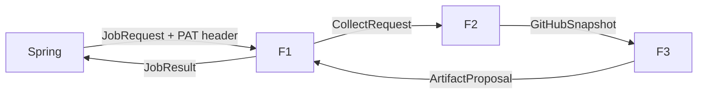
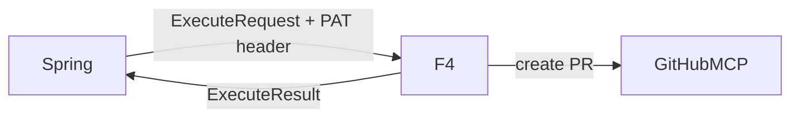

# Blocki-AI GitHub Agent DESIGN

- project: Blocki-AI (DevFlow / Portfolio Agent — FastAPI · LangGraph)
- version: 0.3
- one-liner: Spring이 넘긴 유저별 GitHub PAT로 remote GitHub MCP를 읽고, 진행 메모·템플릿 기반 포폴/이력서·README PR 초안을 만든 뒤, 승인된 README만 PR로 반영하는 무상태 워커
- date: 2026-08-19
- module count: 4 features (F1–F4), C0 없음
- scale verdict: **Small** — FastAPI 서버가 이 레포에 있다. Feature 레벨만. C0 없음.
- supersedes: v0.2 (2026-08-19). 변경 요지는 §10.

## TOC

1. Tech stack
2. Folder tree
3. Main pipeline
4. C0 modules
5. Extension points
6. Feature modules
7. Team contracts
8. Dependency table
9. Implementation checklist
10. Design Decision Log

---

## 1. Tech-stack table

이미 잠긴 값. 재질문하지 않음.

| 영역 | 기술 | 이유 |
| --- | --- | --- |
| 에이전트 HTTP | FastAPI | 담당 스택. Spring만 부르는 내부 API. |
| 제안 파이프라인 | LangGraph 2노드 (`collect` → `build`) | 수집과 산출만 나눈다. LLM 오케스트레이터는 없다. |
| 실행 파이프라인 | 일반 async 함수 (F4) | 쓰기 경로에 LLM이 없다. |
| GitHub 도구 | Remote MCP `https://api.githubcopilot.com/mcp/` | 유저 PAT를 헤더로 넣는 공식 경로. |
| MCP 클라이언트 | `langchain-mcp-adapters` `MultiServerMCPClient` | job마다 새 클라이언트. 전역 재사용 금지. |
| LLM | env로 모델만 교체 | F3에서만 사용. F2/F4에 도구로 넘기지 않음. |
| 유저·토큰·버전 원본 | Spring Boot | FastAPI는 PAT·산출 이력을 저장하지 않음. |
| 포폴/이력서 | `templates/*.md` allowlist 치환 | 팀 합의. 카드 JSON이 아니라 문서. |
| Notion | 후순위, 이 레포 밖 | 과거 버전 로그는 Spring DB 미러 후 Notion. |
| 캘린더 | 제외 | 팀 합의. |
| 배포 | Docker on EC2 | 명세. |

선택하지 않은 것:

- 6개 서브에이전트 / LLM Orchestrator
- FastAPI 토큰 DB, FastAPI 스케줄러, FastAPI 공개 웹훅
- 로컬 `github-mcp-server` Docker (remote가 막힐 때만)
- Job body의 `notion` 필드 (v0.1 제거)
- PAT를 JSON body / LangGraph state에 넣는 것
- 서명된 `approval_grant` HMAC (내부망 + digest로 충분. FastAPI가 외부에 열리면 추가)

---

## 2. Folder tree

```
Blocki-AI/
  DESIGN.md
  Dockerfile
  pyproject.toml
  app/
    main.py                      # composition root
    __main__.py                  # python -m app
    api/
      jobs.py                    # F1 POST /internal/jobs
      executions.py              # F4 POST /internal/executions
    collect/
      github.py                  # F2
    artifacts/
      __init__.py                # build_artifact + 타입
      progress.py                # F3-progress
      profile.py                 # F3-profile (portfolio|resume)
      readme.py                  # F3-readme
    execute/
      readme_pr.py               # F4
    contracts.py
    templates_render.py          # allowlist 치환 함수. 모듈 아님
  templates/
    portfolio/v1.md
    resume/v1.md
  tests/
    test_github_collect.py
    test_profile_render.py
    test_readme_execute.py
```

`app/main.py` 만 피처를 조립한다. 피처끼리 import 금지.

---

## 3. Main pipeline

제안 (읽기):



실행 (쓰기, 승인 후):



조건 분기는 F1 안에만 있다. 제안 라인은 항상 `F1 → F2 → F3 → F1`.

### OUT→IN chain (제안)

| 단계 | OUT | 다음 IN |
| --- | --- | --- |
| Spring | `JobRequest` + `X-GitHub-Pat` | F1 |
| F1 | `CollectRequest` (PAT는 aux, state 밖) | F2 |
| F2 | `GitHubSnapshot` | F3 |
| F3 | `ArtifactProposal` | F1 pack |
| F1 | `JobResult` | Spring |

### OUT→IN chain (실행)

| 단계 | OUT | 다음 IN |
| --- | --- | --- |
| Spring | `ExecuteRequest` + `X-GitHub-Pat` | F4 |
| F4 | `ExecuteResult` | Spring |

파이프라인 실패 정책:

- MCP 일시 오류 `retry(2)` 후 `mcp_unavailable` / `github_rate_limit`
- PAT 없음·401 `halt` (`missing_pat` / `github_auth`)
- 부분 수집 성공 `complete=false`, `status=partial`
- 변화 없음 `status=no_change` (실패가 아님). Spring은 이 경우 cursor를 유지하거나 `next_cursor`만 갱신
- `complete=false` 이면 Spring은 cursor를 갱신하지 않음

---

## 4. C0 modules

none.

거부 기록:

- MCP 팩토리 — F1이 F2/F4에 클라이언트를 넘기지 않고, 각 피처가 자기 요청의 PAT로 만든다. 사용처 2 (F2, F4). rule of three 실패.
- 템플릿 렌더러 — 사용처 2 (portfolio, resume). 함수 `templates_render.py`.
- env 로더, JSON 파서 — module floor 미달.
- Notion 클라이언트 — 이 레포 사용처 0.
- AgentBase / 레지스트리 / DI — 구현체 코드 없음.

---

## 5. Extension points

계약: `build_artifact(snapshot: GitHubSnapshot, job: JobRequest) -> ArtifactProposal`

| job_type | 모듈 | MCP |
| --- | --- | --- |
| `progress_summary` | `artifacts/progress.py` | 없음 |
| `profile_document` | `artifacts/profile.py` | 없음 |
| `readme_proposal` | `artifacts/readme.py` | 없음 |

선택 맵: `app/main.py` 의 `ARTIFACT_BUILDERS`.

variant 추가: 파일 하나 + 맵 한 줄.

`portfolio` / `resume` 는 별 variant가 아니다. `document.kind` 로 같은 렌더러가 템플릿만 고른다.

---

## 6. Feature modules

### 공유 타입 (`contracts.py`)

```
JobType = "progress_summary" | "profile_document" | "readme_proposal"

RepoRef
  owner: str
  name: str

RepoCursor
  owner: str
  name: str
  head_sha: str
  last_success_at: datetime

DocumentSpec
  kind: "portfolio" | "resume"   # 템플릿 경로도 이 값으로 고른다
  template_version: str          # 예: "v1" → templates/{kind}/v1.md
  profile_fields: ProfileFields

ProfileFields                 # Spring이 유저에게 받은 값. 추측 금지
  name: str
  contact_md: str
  experience_md: str          # resume만 필수, portfolio는 빈 문자열 허용
  education_md: str           # resume만 필수

JobRequest
  job_id: str                 # uuid
  user_id: str                # uuid
  job_type: JobType
  repos: list[RepoRef]        # 비면 F2가 접근 가능 레포 최대 5개
  since: datetime | null      # cursor가 있으면 cursor 우선
  cursor: list[RepoCursor] | null
  document: DocumentSpec | null   # profile_document 필수
  readme: ReadmeTarget | null     # readme_proposal 필수

ReadmeTarget
  owner: str
  repo: str
  path: str                   # allowlist만. 기본 "README.md"

CollectRequest
  job_id: str
  repos: list[RepoRef]
  since: datetime | null
  cursor: list[RepoCursor] | null
  needs: set["activity" | "profile_evidence" | "readme"]
  # github_pat 는 타입에 넣지 않는다. 함수 인자 aux.

GitHubSnapshot
  collected_at: datetime
  complete: bool
  snapshot_digest: str        # 안정 해시. 승인 바인딩용
  viewer_login: str | null
  repos: list[RepoActivity]
  next_cursor: list[RepoCursor]
  warnings: list[str]

RepoActivity
  owner: str
  name: str
  default_branch: str | null
  head_sha: str | null
  description: str | null
  topics: list[str]
  languages: list[{name: str, bytes: int}]
  manifest_files: list[str]   # 예: package.json, pyproject.toml 존재만
  commits: list[CommitSummary]
  issues: list[IssueSummary]
  pull_requests: list[PrSummary]
  readme: ReadmeBlob | null

CommitSummary
  sha: str
  message: str
  author: str | null
  committed_at: datetime | null

IssueSummary / PrSummary
  number: int
  title: str
  state: str
  updated_at: datetime | null

ReadmeBlob
  path: str
  blob_sha: str
  content: str

ArtifactProposal
  proposal_id: str
  job_id: str
  status: "proposed" | "no_change" | "partial" | "blocked" | "failed"
  kind: "progress" | "portfolio" | "resume" | "readme"
  body_markdown: str
  template_ref: {kind: "portfolio" | "resume", version: str, sha256: str} | null
  evidence_refs: list[{field: str, repo: str, source_type: str, source_id: str}]
  unresolved_fields: list[str]
  proposed_action: ReadmePrAction | null
  proposal_digest: str        # 아래 해시 규칙. 필드 자신을 해시에 넣지 않음
  action_digest: str | null   # proposed_action 이 있을 때만. hash(action)
  warnings: list[str]
  error: JobError | null

ReadmePrAction
  type: "create_readme_pr"
  owner: str
  repo: str
  path: str
  base_branch: str
  expected_base_sha: str
  expected_blob_sha: str
  replacement_markdown: str
  pr_title: str
  pr_body: str

JobResult
  job_id: str
  ok: bool                    # failed / blocked 만 false. no_change·partial 은 true
  proposal: ArtifactProposal | null
  artifact: {kind, title, body_markdown, proposal_id, template_ref} | null
  snapshot_summary: {complete: bool, repo_count: int, commit_count: int, issue_count: int, pr_count: int}
  next_cursor: list[RepoCursor]   # complete=true 일 때만 Spring이 덮어씀
  error: JobError | null

JobError
  code: "missing_pat" | "github_auth" | "github_rate_limit" | "mcp_unavailable"
      | "llm_failed" | "blocked" | "stale_sha" | "duplicate" | "internal" | "validation"
  message: str
  retryable: bool

ExecuteRequest
  execution_id: str
  proposal_id: str
  action_digest: str          # Spring이 제안 당시 저장한 값. F4는 hash(action)과 비교
  action: ReadmePrAction
  idempotency_key: str        # 반드시 proposal_id 와 동일. 아니면 validation

ExecuteResult
  execution_id: str
  status: "created" | "duplicate" | "rejected"
  pr_url: str | null
  error: JobError | null
```

`structured: dict`, `extra: dict`, `notion` 필드는 없다.

### 해시 규칙 (blocker 수정)

두 해시를 섞지 않는다. 둘 다 **자기 자신 필드를 제외한** canonical JSON의 SHA-256 hex.

```
proposal_digest = sha256(canonical({
  job_id, kind, body_markdown, template_ref,
  evidence_refs, unresolved_fields, proposed_action,
  snapshot_digest  # GitHubSnapshot.snapshot_digest
}))

action_digest = sha256(canonical(ReadmePrAction))
```

- F1/F3가 둘 다 채워 반환한다. `proposed_action`이 없으면 `action_digest=null`.
- F4는 `sha256(canonical(req.action)) == req.action_digest` 만 검사한다. `proposal_digest`를 쓰지 않는다.
- Spring은 승인 시 제안 행에 저장된 `action_digest`와 `action_json`을 그대로 보낸다. 클라이언트가 action을 고쳐 보내면 거절된다.

canonical JSON: UTF-8, 키 정렬, 공백 없음, datetime은 ISO-8601 UTC.

### README 경로 allowlist

`ReadmeTarget.path` / `ReadmePrAction.path` 는 다음만 허용한다. 그 외는 F1·F4 `validation`.

- `..` 없음, 절대경로 없음, `\` 없음
- 정규식: `^(docs/)?README(\.(md|markdown|rst|txt))?$` (대소문자 무시)
- 기본값: `README.md`

---

### F1 JobIngress

PUBLIC: `handle_job(req: JobRequest, github_pat: str) -> JobResult`

IN (main): `req: JobRequest` ← Spring JSON

IN (aux):

- `github_pat: str` ← 헤더 `X-GitHub-Pat`. Pydantic 모델·그래프 state·로그·응답에 넣지 않음
- `internal_key: str` ← `X-Internal-Key`, `main.py` 가 env에서 읽음
- `builders` ← root 선택 맵
- `collect_fn` ← F2
- `llm` ← root, F3에만 전달

OUT: `JobResult`

FAIL: 헤더 키 실패는 HTTP 401 (그래프 진입 전). PAT 공백은 `missing_pat`.

내부 로직:

1. `X-Internal-Key` 검증
2. `job_type`별 필수 필드 검증 (`document` / `readme`)
3. `needs` 결정: progress→activity, profile→profile_evidence+activity, readme→readme
4. F2 호출 (PAT는 인자로만)
5. F3 선택 맵 호출
6. `proposal_digest` / `action_digest` 를 위 해시 규칙으로 채움. `proposal_digest` 필드 자신을 해시에 넣지 않음

constraints:

- LLM 라우팅 없음. `job_type` 고정 맵.
- 채팅 문장 분류가 필요하면 Spring이 `job_type`으로 바꿔 보낸다.
- 동기 한 요청 = 한 잡. 타임아웃 60s.

parallel-safe: no (요청 단위)

REMOVE: `api/jobs.py` 삭제 + `main.py` 라우터 제거.

---

### F2 GitHubCollect

PUBLIC: `collect_github(req: CollectRequest, github_pat: str) -> GitHubSnapshot`

IN (main): `req: CollectRequest` ← F1  
IN (aux): `github_pat: str` ← F1, state 밖

OUT: `GitHubSnapshot`

FAIL: 전면 401/429/연결 실패는 예외 → F1이 `JobError`로 변환. 레포 1개 실패는 건너뛰고 `warnings` + `complete=false`.

내부 로직:

1. job마다 MCP 클라이언트 생성.

```python
client = MultiServerMCPClient({
    "github": {
        "transport": "http",
        "url": "https://api.githubcopilot.com/mcp/",
        "headers": {
            "Authorization": f"Bearer {github_pat}",
            "X-MCP-Toolsets": "context,repos,issues,pull_requests",
            "X-MCP-Readonly": "true",
        },
    }
})
```

2. 코드가 도구를 고정 호출. LLM에게 MCP를 열지 않음.
   1. `get_me`
   2. `repos` 비면 목록에서 최대 5개
   3. 레포 메타: default_branch, head_sha, description, topics, languages, manifest 존재
   4. `needs`에 activity면 since/cursor 이후 커밋·이슈·PR (커밋 30, 이슈 20, PR 20)
   5. `needs`에 readme면 해당 파일 content + blob_sha
3. cursor의 `head_sha`와 현재 `head_sha`가 같고 추가 이벤트가 없으면 그 레포는 빈 활동으로 둔다. 전부 그대로면 F3가 `no_change`를 낸다.

constraints:

- toolset `all` / Copilot / Actions / Security 금지
- 클라이언트 전역 캐시 금지 (유저 PAT 교차 사용)
- 로그에 PAT·Authorization 헤더 금지

parallel-safe: yes (레포 fan-out 가능). 1차는 직렬. secondary rate limit 우선.

REMOVE: `collect/github.py` 삭제 + F1 collect 호출 제거. F3 IN 소멸.

---

### F3 ArtifactBuilder

PUBLIC: `build_artifact(snapshot, job, llm) -> ArtifactProposal`  
각 variant: `build(...)` 하나.

IN (main): `snapshot: GitHubSnapshot` ← F2  
IN (aux): `job: JobRequest` ← F1, `llm` ← root

OUT: `ArtifactProposal`

FAIL: LLM 예외 `llm_failed`. 필수 프로필 누락 `blocked`. 쓰기는 하지 않음.

공통:

- MCP 도구 없음. 레포 텍스트는 데이터로만 넣는다 (prompt injection 격리).
- 기술 스택은 `languages` + `topics` + `manifest_files` + `profile_fields` 만. 없으면 빈 칸. 환각 금지.
- 필드마다 `evidence_refs`를 채운다.

#### F3-progress

- 커밋/이슈/PR을 날짜순 한국어 메모
- snapshot이 비어 있고 `complete=true` 이면 `status=no_change`, `body_markdown=""`
- `proposed_action=null`

#### F3-profile (`kind=portfolio|resume`)

- 템플릿 파일: `templates/{kind}/{version}.md`
- 치환은 allowlist만. Jinja/조건식 금지.

| placeholder | 출처 |
| --- | --- |
| `{{name}}` | `profile_fields.name` |
| `{{contact_md}}` | `profile_fields.contact_md` |
| `{{experience_md}}` | `profile_fields.experience_md` |
| `{{education_md}}` | `profile_fields.education_md` |
| `{{summary_md}}` | GitHub 활동 요약 (evidence 필수) |
| `{{skills_md}}` | languages/topics/manifest (evidence 필수) |
| `{{projects_md}}` | 레포 목록 + 최근 활동 (evidence 필수) |

- resume는 `name`, `experience_md`, `education_md` 없으면 `blocked`
- portfolio는 `name` 없으면 `blocked`, 경력/학력은 빈 문자열
- `template_ref.sha256` = `templates/{kind}/{version}.md` 파일 해시. `kind`가 경로 전부다. 별도 `template_id` 없음

#### F3-readme

- 개선안 `replacement_markdown` + `proposed_action`
- 현재 README와 동일하면 `no_change`
- **PR을 만들지 않음**

constraints: variant끼리 import 금지. GitHub 재호출 금지.

parallel-safe: yes (job당 LLM 1회)

REMOVE: variant 파일 삭제 + 맵 키 제거.

---

### F4 GitHubActionExecutor

PUBLIC: `execute_readme_pr(req: ExecuteRequest, github_pat: str) -> ExecuteResult`

IN (main): `req: ExecuteRequest` ← Spring  
IN (aux): `github_pat` ← `X-GitHub-Pat`, `internal_key` ← `X-Internal-Key`

OUT: `ExecuteResult`

FAIL: digest 불일치 `rejected/validation`, SHA 불일치 `stale_sha`, 중복 `duplicate`, GitHub 401/429는 해당 코드.

내부 로직:

1. `path` allowlist 검사. `action.type` 은 `create_readme_pr` 만.
2. `sha256(canonical(req.action)) == req.action_digest` 아니면 거절. `proposal_digest`는 보지 않음.
3. `idempotency_key == proposal_id` 아니면 `validation`. 브랜치명 = `blocki/readme-{proposal_id}` (**UUID 전체**. 앞 8자만 쓰면 충돌). 키가 브랜치명으로 쓰인다.
4. **멱등 (기록은 GitHub. 동시 재시도 포함)**
   - 시작 시 그 head 브랜치의 PR을 **open/closed/merged 전부** 조회. 하나라도 있으면 `duplicate` + 그 `pr_url`. 커밋·새 PR 없음.
   - 브랜치만 있고 PR 없음: blob == replacement 이면 PR만 생성. 다르고 expected SHA가 맞으면 파일 갱신 후 PR. SHA가 깨졌으면 `stale_sha`.
   - 브랜치 없음: expected SHA 확인 → 브랜치 생성 → 커밋 → PR.
   - 브랜치 생성·PR 생성이 409/422(already exists)이거나 레이스면 **한 번 재조회**(모든 상태 PR): PR이 있으면 `duplicate` + 그 URL. 브랜치만 있으면 위 “브랜치만” 경로. 재조회도 없으면 `internal` retryable=true.
5. MCP write: `X-MCP-Toolsets: repos,pull_requests`, `X-MCP-Readonly: false`
6. **default branch 직접 푸시 금지**

Spring: 성공한 `proposal_id`를 실행 완료로 표시해 재전송을 줄인다. 줄이지 못해도 F4 재조회가 한 PR로 수렴해야 한다.

constraints:

- LLM 없음
- `approved: true` 불리언 없음
- 이슈 생성, 파일 임의 경로, force push 없음

parallel-safe: no (같은 레포 PR 경쟁). idempotency로 흡수.

REMOVE: `execute/readme_pr.py` + `api/executions.py` 삭제. 제안 파이프라인은 남음.

---

## 7. Team contracts

### 7.1 담당

| 담당 | 한다 | 하지 않는다 |
| --- | --- | --- |
| **AI / FastAPI / GitHub** | Job·Execute API, MCP 수집/쓰기, 템플릿 파일, 3개 산출, digest, SHA 검사 | 유저 DB, PAT 금고, 로그인, 공개 웹훅, 스케줄 시계, Notion 페이지 |
| **Spring** | JWT, PAT 암호화, `X-GitHub-Pat` 주입, 스케줄/웹훅→Job POST, proposal/버전 DB, 승인 UI, 알림 | LangGraph, MCP 세션, 템플릿 문구 생성 |
| **Notion 팀원 (후순위)** | OAuth, 과거 포폴/이력서 `.md` 를 로그 페이지로 남김 | GitHub 수집, 승인 게이트 |

「깃허브 파트 전부」= GitHub 읽기·산출·승인 후 PR. 토큰 금고는 Spring.

### 7.2 HTTP

`POST /internal/jobs`  
headers: `X-Internal-Key`, `X-GitHub-Pat`  
body: `JobRequest` (PAT 없음)  
200: `JobResult`

`POST /internal/executions`  
headers: 동일  
body: `ExecuteRequest`  
200: `ExecuteResult`

웹훅 URL은 Spring. FastAPI는 내부망.

### 7.3 PAT

- 저장: Spring 암호화
- 전달: `X-GitHub-Pat` 만. body/state/checkpoint/로그 금지
- 요청이 끝나면 FastAPI 메모리에서 버려짐
- GitHub는 요청마다 PAT 스코프를 바꿀 수 없다. **유저 PAT 하나**를 Spring이 저장한다.
- README PR을 쓸 계정이면 PAT에 Contents write + Pull requests write 가 처음부터 들어 있다.
- “실행 시에만 쓰기”는 토큰 스코프가 아니라 FastAPI가 **F2에서 `X-MCP-Readonly: true`로 쓰기 도구를 안 열고, F4에서만 연다**는 뜻이다.
- PR을 안 쓸 사용자는 read-only PAT로도 제안 파이프라인이 동작해야 한다. F4는 그때 401 → `github_auth`.
- remote MCP OAuth(브라우저+Copilot)는 크론에 안 맞음. PAT 유지

### 7.4 산출물 저장 (팀 합의)

1. FastAPI는 완성 `body_markdown` + `template_ref` + `snapshot_digest` + `proposal_digest` 를 반환한다.
2. **원본 버전은 Spring DB.** 미리보기·승인·이력의 기준.
3. Notion은 나중에 같은 `.md` 를 로그로 붙인다. FastAPI는 Notion을 호출하지 않는다.

### 7.5 승인

Spring이 저장: `proposal_id, user_id, job_id, artifact_markdown, template_ref, snapshot_digest, action_json, action_digest, proposal_digest, status, created_at, expires_at`

사용자가 승인하면 Spring이 저장해 둔 `action_json` + `action_digest`를 `ExecuteRequest`로 보낸다. F4는 `hash(action)==action_digest` 와 expected SHA가 맞을 때만 PR을 연다. `proposal_digest`는 Spring이 미리보기 문서 무결성용이지 F4 실행 키가 아니다.

자동 반영은 옵션. 기본은 미리보기+승인. 스케줄러 1차는 알림만.

### 7.6 MCP 설정 (재확인)

GitHub (job마다 동적):

```yaml
mcp_servers:
  github:
    url: "https://api.githubcopilot.com/mcp/"
    headers:
      Authorization: "Bearer {유저의_GitHub_PAT}"
      X-MCP-Toolsets: "context,repos,issues,pull_requests"
      X-MCP-Readonly: "true"   # F4만 false, toolsets에 pull_requests 유지
```

Notion (후순위, 팀원):

```yaml
mcp_servers:
  notion:
    url: "https://mcp.notion.com/mcp"
```

호스트 Notion MCP는 OAuth만. 크론은 Spring이 access token을 갱신해야 한다.

`https://github.com/github/github-mcp-server` 는 문서 레포이지 호출 URL이 아니다.

### 7.7 다른 의견(6에이전트) 판정

| 제안 | 판정 | 이유 |
| --- | --- | --- |
| Spring → FastAPI → GitHub MCP | KEEP | 그대로 |
| 분석→제안→승인→실행 | KEEP | F1–F3 / F4로 구현 |
| 유저별 토큰 격리 | KEEP | 헤더 PAT, 클라이언트 job 단위 |
| Orchestrator | CUT | Spring `job_type` |
| Repo Analyzer | KEEP as F2 | 결정적 수집 |
| Progress Tracker | MERGE | 감지는 F2, 요약은 F3-progress, cursor는 Spring |
| README Writer | KEEP as F3-readme | 초안만 |
| Portfolio Builder | CHANGE | resume와 같은 템플릿 렌더러 |
| Action Executor | KEEP as F4 | 쓰기만 |
| 채팅 의도 분석 | CUT (지금) | UI 버튼 → job_type. 채팅은 Spring이 매핑 |
| 스케줄 자동 반영 | 마지막 | 1차는 notify |

---

## 8. Dependency table

| 모듈 | 사용 |
| --- | --- |
| F1 | F2, F3 맵, env 키 |
| F2 | GitHub MCP read-only |
| F3-* | F2 OUT + LLM + 템플릿 파일. MCP 없음 |
| F4 | GitHub MCP write, ExecuteRequest |
| C0 | 없음 |

순환 없음. F3↔F4 직접 호출 없음. Spring이 둘을 잇는다.

---

## 9. Implementation checklist

1. [x] `contracts.py` + 템플릿 `portfolio/v1.md`, `resume/v1.md`
2. [x] `POST /internal/jobs` (키 없으면 401, PAT 없으면 `missing_pat`)
3. [x] `scripts/ping_github_mcp.py` — 헤더 PAT로 `get_me` + 레포 1개
4. [x] F2 본구현 + MCP mock 테스트
5. [x] F3-progress + `no_change` (실패 아님)
6. [ ] Spring이 이 서버를 호출하고 proposal을 DB에 저장
7. [x] F3-readme preview + `proposal_digest`
8. [x] F4 PR 경로 (승인 후 `/internal/executions`)
9. [x] F3-profile 템플릿 렌더 + evidence
10. [ ] cron: 변화 없으면 `no_change` + notify. 자동 PR은 scoped 정책 이후

경계 테스트:

- F1: 잘못된 `job_type` → 422. profile인데 `document` 없음 → 422
- F2: MCP 401 → `github_auth`. 429 → `github_rate_limit`. `complete=false`면 cursor 미갱신 문서화
- F3: 빈 snapshot + complete → `no_change`. resume 학력 없음 → `blocked`
- F3: languages 없이 스택을 지어내면 테스트 실패
- F4: `action_digest` 불일치 거절. SHA 불일치 `stale_sha`. 같은 브랜치 PR이 어떤 상태든 있으면 `duplicate`+기존 URL. 경로 allowlist 밖이면 `validation`

---

## 10. Design Decision Log

```
[SCALE  ] Small — Feature only, no C0
[KEEP   ] F2 deterministic collect — MCP/rate-limit 변경 이유 + 3산출 재사용 + 독립 테스트
[SPLIT  ] F4 execute out of F3 — 쓰기/멱등/SHA vs 프롬프트. 변경 이유 2 + 안전 주기 다름
[MERGE  ] Progress Tracker — F2 감지 + F3-progress 요약 + Spring cursor
[CUT    ] LLM Orchestrator — Spring typed job_type. 채팅 분류는 제품이 생기면 Spring
[CUT    ] 6에이전트 스웜 — 해커톤 과분할, 도구 폭주
[VARIANT] ArtifactBuilder {progress, profile_document, readme_proposal}
[KEEP   ] portfolio|resume 한 렌더러 — 같은 IN/OUT, kind만 다름. 별 모듈 거부
[CHANGE ] 포폴을 카드 JSON이 아니라 .md 템플릿 채움 — 팀 합의
[CUT    ] JobRequest.notion — Notion 후순위, 계약 오염
[CUT    ] 캘린더
[CHANGE ] PAT body → X-GitHub-Pat — body/state 유출 차단 (sol)
[CHANGE ] empty 실패 → no_change/partial/failed 분리 (sol)
[CHANGE ] F2에 languages/topics/manifest/head_sha — F3 환각 방지에 필요
[CHANGE ] F3 향후 PR 쓰기 문구 삭제 — F3는 순수 산출
[KEEP   ] 분석→제안→승인→실행
[LOCAL  ] 서명 approval_grant HMAC — 내부망 + X-Internal-Key면 해커톤 수용. digest는 승인 증명이 아니라 변조 검사다. 외부 노출 시 HMAC 추가
[CHANGE ] proposal_digest와 action_digest 분리 — F4는 action 해시만 비교
[CHANGE ] README path allowlist — 임의 경로 쓰기 차단
[CHANGE ] PAT write 스코프는 요청마다 바뀌지 않음. 읽기 전용 헤더로 실행 경로만 연다
[CHANGE ] F4 멱등: 브랜치=`blocki/readme-{proposal_id}` 전체 UUID. PR은 open/closed/merged 전부 조회. 409/422 후 재조회
[CHANGE ] template_id 삭제. kind + version이 경로
[LOCAL  ] FastAPI 스케줄러/웹훅
[LOCAL  ] 로컬 github-mcp-server
[LOCAL  ] GitHub OAuth on FastAPI
[KEEP   ] 수집을 LLM+전체 MCP 루프로 두지 않음
```

v0.1 → v0.2:

- `progress_memo` → `progress_summary`
- `portfolio_card` → `profile_document`
- 산출 HTTP와 실행 HTTP 분리
- Notion handoff 삭제

v0.2 → v0.3:

- FastAPI 서버를 이 레포에 둠 (`python -m app`, Dockerfile)
- 로컬 실험용 `X-Notion-Token` / `JobResult.notion` / `app/notion` 삭제. FastAPI는 Notion을 호출하지 않는다 (v0.2 §7.4 복구)

[self-check: C0 none; Notion surface removed; 3 variants; HMAC still local]
